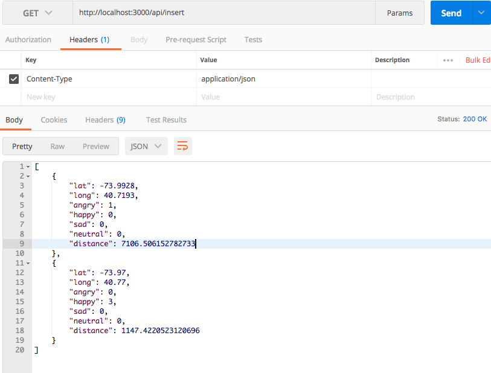

# Getting Started with the Geospatial #

## Prerequisites
- Node.js installed and working on your development machine. 
- MongoDb installed and running on your development machine.

## APIS Endpoint
- ** POST: ** [Insert](http://localhost:3000/api/insert)
- ** GET: ** [Retrive](http://localhost:3000/api/insert)




## Algo
Required Schema:
 ```Shell
    var PlacesSchema = new Schema({
        name: {
            type: String,
            required: false
        },
        location: {
            "type": { type: String },
            "coordinates" :[]
        },
        emotion: {
            type: String,
            required: false
        }
    });
 ```   

Hardcoded for one coordinae: [ -73.9667, 40.78 ] in function.

## Function

    var pipeline = [
        {
            $geoNear: {
               near: { type: "Point", coordinates: [ -73.9667, 40.78 ] },
               spherical: true,
               distanceField: "distance"
            }
         },
         { $group : { _id : "$location", emotions: { $push: "$emotion" }, distance: { $push: "$distance" }} }
    ];

    var resArr = [];
     Places.aggregate(pipeline, function(err, result){
        
        if(result)
        result.forEach(element => {

                //count the emotions
                let happy = 0;
                let angry = 0;
                let sad = 0;
                let neutral = 0;

                if(element.emotions)
                element.emotions.forEach(element => {
                    if(element == 'happy'){
                        happy++;
                    }
                    if(element == 'angry'){
                        angry++;
                    }
                    if(element == 'sad'){
                        sad++;
                    }
                    if(element == 'neutral'){
                        neutral++;
                    }
                }) 

                let obj = {
                                lat: element._id.coordinates[0],
                                long: element._id.coordinates[1],
                                angry: angry,
                                happy: happy,
                                sad: sad,
                                neutral: neutral,
                                distance: element.distance[0],
                            };

                resArr.push(obj);
                
        });
        res.status(200).json(resArr);
     });    

Open your command prompt or shell and enter the following command to install dependencies.
 ```Shell
npm install
```
 ## Run the sample
 Open your command prompt or shell and enter the following command.
 ```Shell
npm start
```

## Resources ##

[MongoDB Spatial](https://docs.mongodb.com/manual/reference/command/geoSearch/)
[Spatial](https://docs.mongodb.com/manual/geospatial-queries/)
[Mongo DB](http://excellencenodejsblog.com/mongoose-aggregation-count-group-match-project/)
